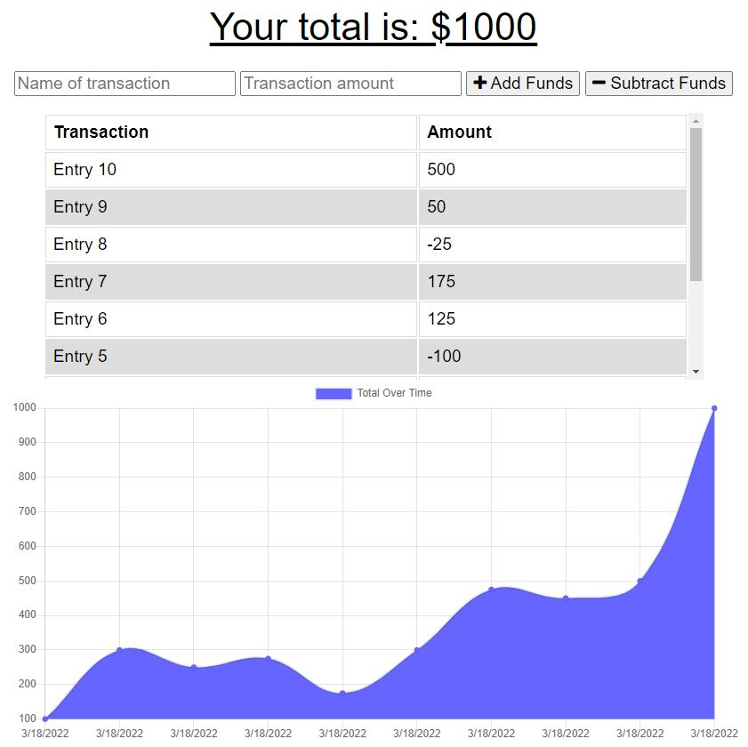

# CashTrack

## Description
CashTrack is a financially intelligent progressive web application and budget tracker that allows users to enter names for their transactions, add funds to their budget, and delete funds from their budget.  CashTrack displays their money flow over time to make users more aware of their spending habits and trends.  Users can explore the website or downloaded the app version.  The app also provides offline functionality and access so that users never miss a dime!

## **Table of Contents**
* [Screenshot](#screenshot)
* [Programs](#programs)
* [Website](#website)
* [Installation](#installation)
* [License](#license)
* [Questions](#questions)

## **Screenshot**

## **Programs**
* Compression
* CSS
* Express
* Heroku
* HTML
* IndexedDB
* JavaScript
* MongoDB
* Mongoose
* Morgan
* Node

## **Website**
[CashTrack](https://calm-shelf-39493.herokuapp.com/)

## **Installation**
***Note: Using Chrome is highly recommended for the optimal experience***
1. To download the app version, open Chrome on your computer or smart phone
2. Visit the [CashTrack website](https://calm-shelf-39493.herokuapp.com/)
3. At the top right of the address bar, click the install button which may be in the form of a `+` or a desktop computer icon
4. Follow the onscreen instructions to install
5. Click the app icon on your desktop or smart phone home screen to open the app!

## **License**
The project is distributed under the [Creative Commons License](https://creativecommons.org/publicdomain/zero/1.0/)

## **Questions**
Please contact me directly with any additional questions:
* [GitHub](https://github.com/ChristopherLawn)
* [Email](mailto:christopher.d.lawn@gmail.com)
